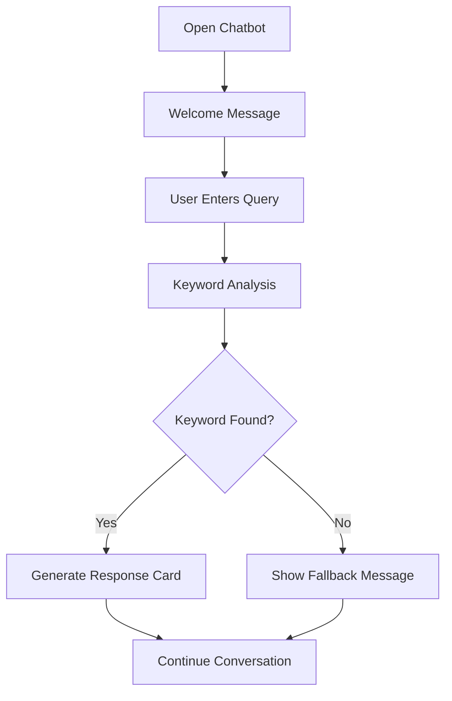

# 🎓 Campus Assistant Bot

<div align="center">

# 🤖 Campus Assistant Bot

### AI-Based College Information Assistant

A modern, responsive, and interactive chatbot designed to provide instant campus-related information to students, faculty, parents, and visitors.

[](https://script.google.com/macros/s/AKfycbyOtQbFiRyzEHbeRxn4rN4BSQiG5XnYOoDet7-XN_iB/dev)


### 🔗 Live Application

**https://script.google.com/macros/s/AKfycbyOtQbFiRyzEHbeRxn4rN4BSQiG5XnYOoDet7-XN_iB/dev**

</div>

---

# 📖 Project Overview

Campus Assistant Bot is an AI-inspired college information chatbot developed using Google Apps Script, HTML, CSS, and JavaScript.

The chatbot acts as a virtual campus help desk that provides instant answers regarding:

* College Timings
* Academic Departments
* Library Information
* Examination Schedules
* Placement Details
* Admissions
* Hostel Facilities
* Events
* Contact Information

This system helps students and visitors access information quickly without requiring administrative assistance.

---

# 🌟 Key Features

## ⚡ Quick Access Buttons

One-click access to:

* 🕒 Timings
* 🏫 Departments
* 📚 Library
* 📝 Exams
* 💼 Placements
* 🎓 Admissions
* 🏠 Hostel
* 📅 Events
* 📞 Contact

---

## 🎴 Interactive Response Cards

Beautiful card-based responses with:

* Icons
* Structured Layout
* Easy Reading Format
* Mobile Optimization

---

## 🔍 Smart Keyword Recognition

The chatbot:

* Detects keywords
* Matches predefined intents
* Generates accurate responses
* Provides instant results

---

## 🛡️ Intelligent Fallback System

If a query is unsupported:

* User receives a friendly message
* Supported topics are suggested
* Conversation continues smoothly

---

## 📱 Fully Responsive Design

Works perfectly on:

* Desktop 💻
* Tablet 📱
* Mobile 📲

---

## 👍 User Feedback System

Each response includes:

* 👍 Helpful
* 👎 Not Helpful

for tracking user satisfaction.

---

# 👥 Target Users

| User           | Purpose                   |
| -------------- | ------------------------- |
| Students       | Academic Information      |
| Parents        | College Information       |
| Faculty        | Administrative References |
| Visitors       | Campus Guidance           |
| New Admissions | Admission Support         |

---

# 🛠️ Technology Stack

| Technology         | Purpose           |
| ------------------ | ----------------- |
| Google Apps Script | Backend & Hosting |
| HTML5              | User Interface    |
| CSS3               | Styling           |
| JavaScript ES6     | Functionality     |
| Google Drive       | Storage           |

---

# 🔄 Conversation Flow



---

# 📸 Project Screenshots

## 🏠 Home Screen

* Welcome Message
* Quick Access Cards
* Interactive Buttons

## 🕒 Timings Information

Displays:

* Monday – Saturday
* 8:00 AM – 5:00 PM

## 🏫 Departments Information

Available Departments:

* Computer Engineering
* Information Technology
* Mechanical Engineering
* Civil Engineering
* Electronics & Telecommunication Engineering
* First Year Engineering

## 📚 Library Information

Features:

* Reading Hall
* E-Library
* Digital Journals
* 50,000+ Books

## 💼 Placement Information

Top Recruiters:

* TCS
* Infosys
* Wipro
* Bosch
* L&T

Average Package:
**₹4.5 LPA**

---

# 📚 Supported Queries

The chatbot currently supports:

```text
College Timings
Departments
Library
Examinations
Placements
Admissions
Hostel
Events
Contact Information
Fees Information
```

---

# 📂 Project Structure

```text
Campus-Assistant-Bot/
│
├── Code.gs
├── index.html
├── styles.css
├── script.js
│
├── assets/
│   ├── icons/
│   └── images/
│
├── screenshots/
│
├── README.md
│
└── LICENSE
```

---

# 🚀 Deployment

The application is deployed using Google Apps Script.

### Live URL

https://script.google.com/macros/s/AKfycbyOtQbFiRyzEHbeRxn4rN4BSQiG5XnYOoDet7-XN_iB/dev

---

# 🏆 Results & Achievements

✅ Successfully deployed online

✅ Accurate responses for all supported topics

✅ Mobile Friendly Interface

✅ Interactive User Experience

✅ Fast Response Time

✅ Structured Information Cards

✅ User Feedback System

✅ Always-Visible Information Panel

---

# 🔮 Future Scope

Planned enhancements:

* 🤖 AI Integration (OpenAI / Claude)
* 🎤 Voice Assistant Support
* 🌐 Multilingual Support
* 📊 Analytics Dashboard
* 🔔 Push Notifications
* 🗄️ Database Integration
* 📅 Dynamic Timetable Updates
* 📢 Event Notifications

---

# 👨‍💻 Developer

### Karan Lingayat

Campus Assistant Bot Project

Academic Year: 2024–2025

---

# 📞 Contact

For project-related queries:

📧 Email: [karan942006@gmail.com](mailto:karan942006@gmail.com)

🌐 Live App:
https://script.google.com/macros/s/AKfycbyOtQbFiRyzEHbeRxn4rN4BSQiG5XnYOoDet7-XN_iB/dev

---

<div align="center">

## ⭐ Star this Repository if you like the project ⭐

### Made with ❤️ using Google Apps Script, HTML, CSS & JavaScript

🚀 Happy Coding!

</div>
